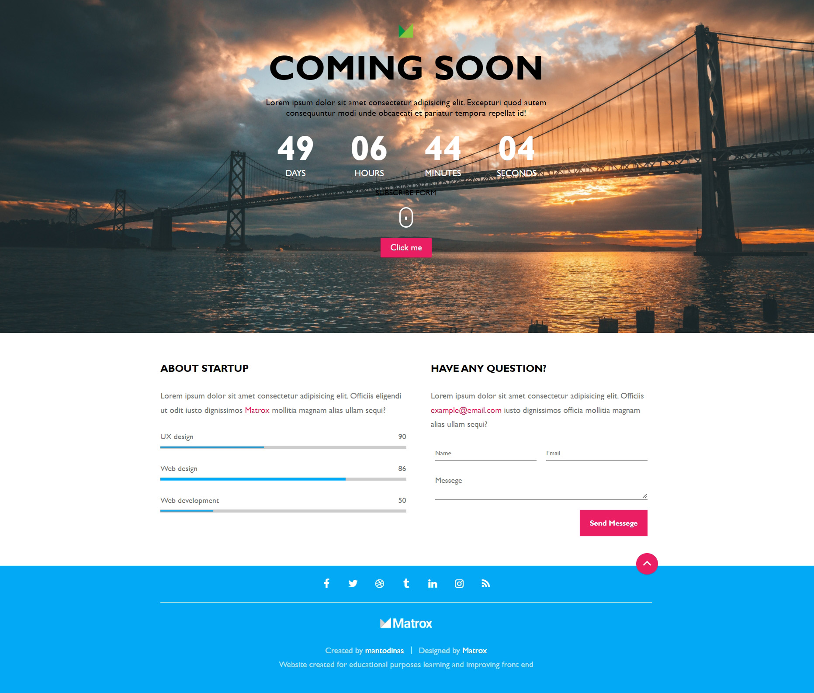

# Coming soon

 
   

Responsive design, repetitive content is generated/rendered, CSS animations, NodeJS.
 Website created learning and improving front-end.

Design from: https://bit.ly/37349iN

Site published at https://mantodinas.github.io/Coming-Soon/

Created by Mantas Petrauskas 
 more projects https://github.com/mantodinas

